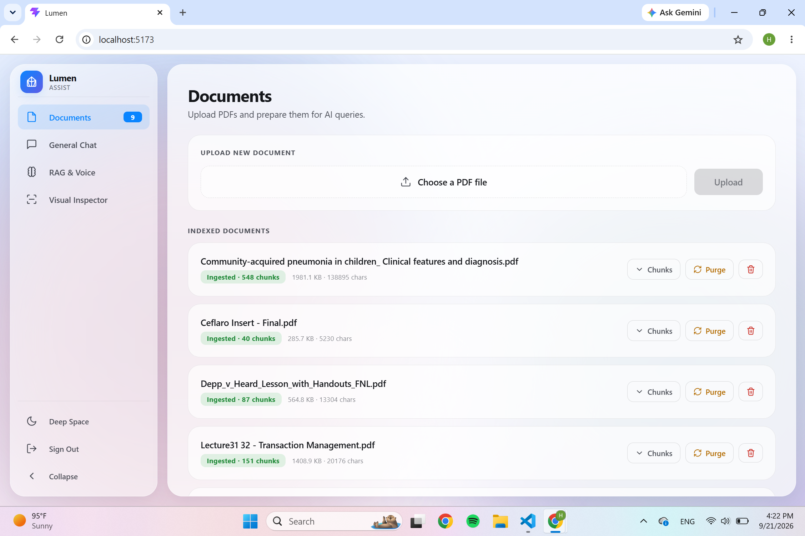
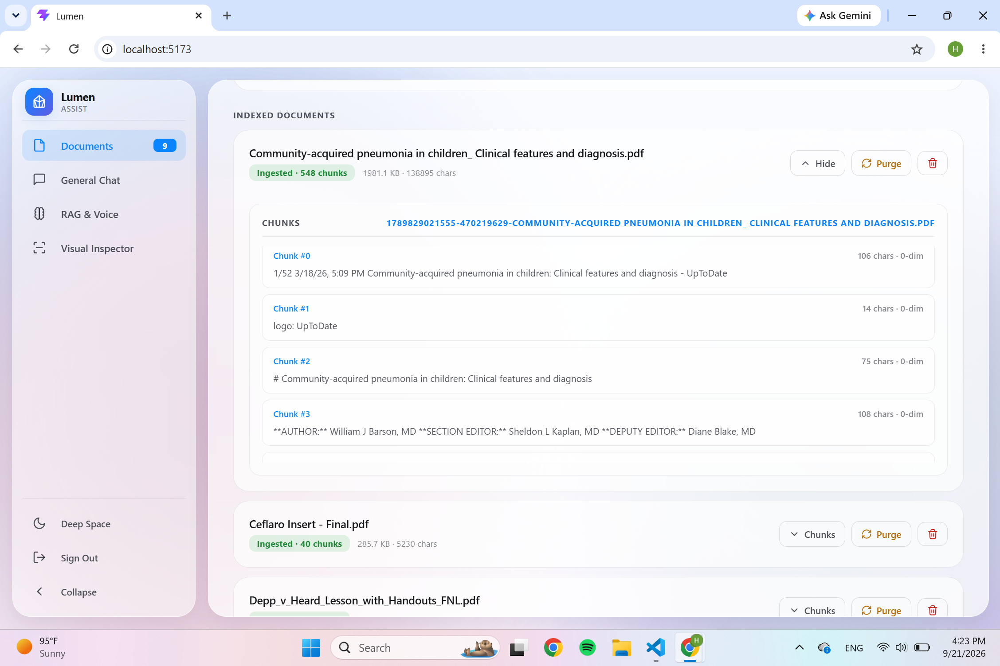
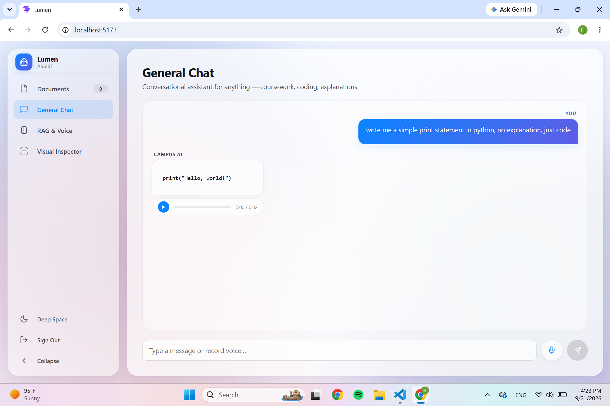
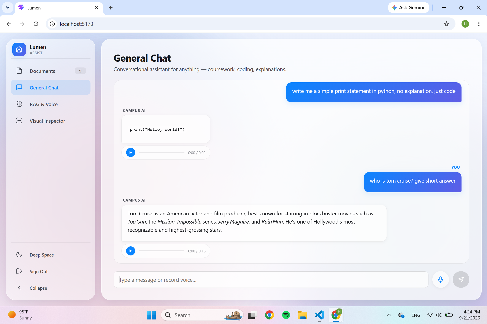
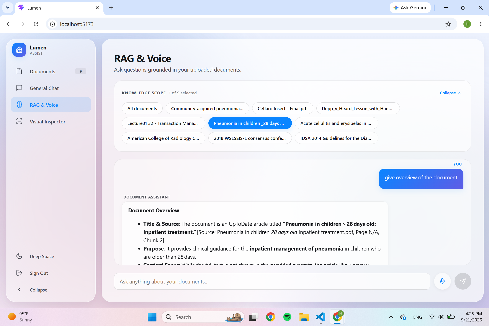
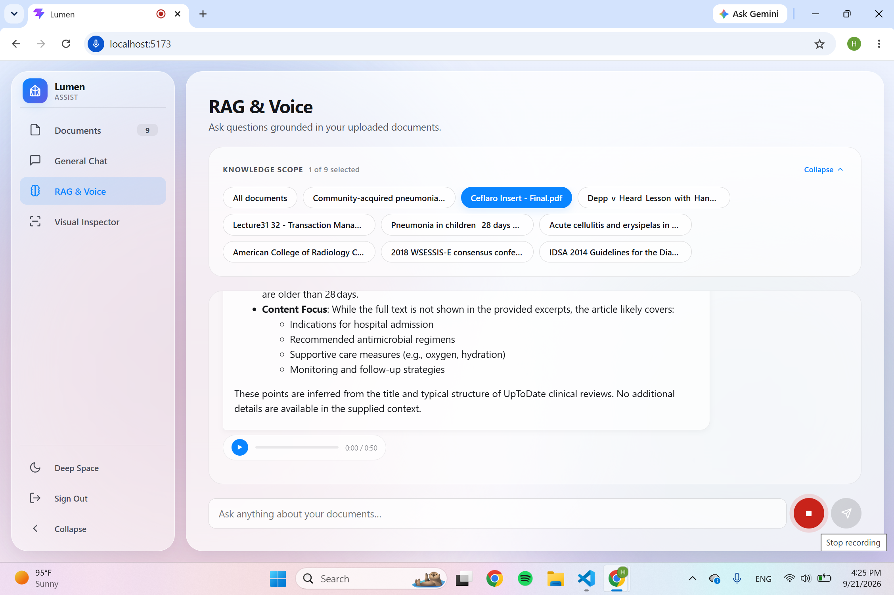
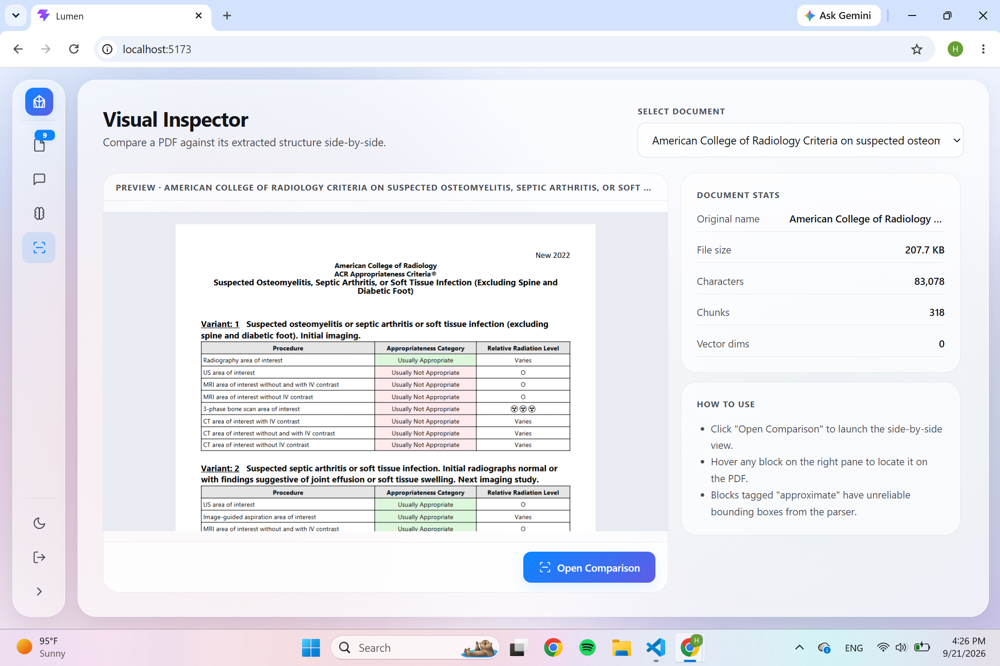
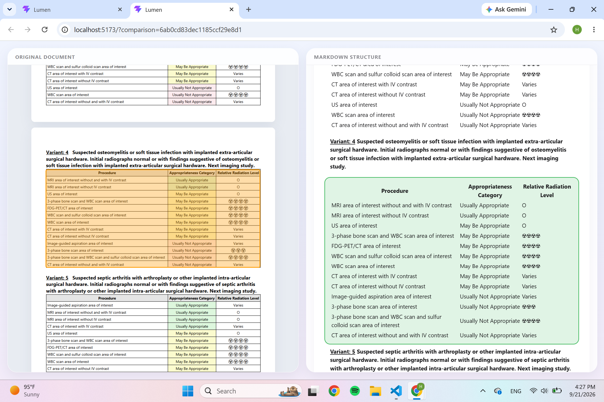
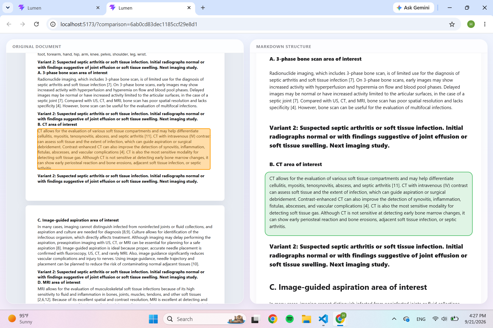

# Lumen — AI Campus Assistant

A full-stack campus query platform with document understanding, conversational AI, voice interaction, and a visual document inspector.

---

## Table of Contents

- [What It Does](#what-it-does)
- [Tech Stack](#tech-stack)
- [Prerequisites](#prerequisites)
- [Setup](#setup)
- [Environment Variables](#environment-variables)
- [Running the App](#running-the-app)
- [Postman Workflow](#postman-workflow)
- [Project Structure](#project-structure)
- [Common Commands](#common-commands)
- [What You Must Improvise](#what-you-must-improvise)
- [License](#license)

---

## What It Does

The system has four main features, plus a parsing quality showcase that demonstrates how the underlying document pipeline handles structured content.

### 1. Documents Hub

The Documents Hub is where every document enters the system and gets prepared for AI retrieval. When you upload a PDF, the backend sends it to LlamaParse for layout-aware text extraction, then splits the extracted content into semantically coherent chunks, and finally converts each chunk into a 384-dimensional vector embedding using a local Xenova transformer model. All of this happens asynchronously — the hub shows you a live status for each document, indicating whether it is still staged (uploaded but not yet processed) or fully ingested (chunked and embedded). From the hub, you can also purge a document's embeddings without deleting the original file, or permanently remove the document and all associated data. The goal is transparency: you should always be able to see exactly what the AI will be retrieving from, and to fix or reset anything that looks wrong.

**Uploading a PDF to the Documents Hub**



This view shows the upload panel at the top of the Documents Hub. You select a PDF from your machine, and the hub stores the file on disk while recording its metadata in MongoDB. The document appears immediately in the indexed documents list below, marked as "Staged" until you trigger ingestion.

**Previewing the generated chunks**



Once a document has been ingested, you can expand it to inspect every chunk that was generated. Each chunk shows its index, character count, vector dimensions, and full text. This is the same content the RAG pipeline retrieves from at query time, which means you can verify that the chunking was sensible — tables intact, paragraphs unbroken — before ever asking the AI a question about the document.

### 2. General AI Chat

The General AI Chat is a conversational assistant for anything that isn't tied to a specific document — coursework questions, coding problems, conceptual explanations, or general queries. It maintains a rolling memory of the last five messages, so follow-up questions can rely on context from earlier in the same conversation. The assistant is backed by a three-layer service architecture: a live service that calls Groq with streaming responses, a mock service that returns graceful stub responses when the live service is unavailable, and a proxy that selects between them. Responses are rendered as Markdown, including support for code blocks, tables, and LaTeX-style math. Each AI response also has a built-in text-to-speech control, so you can listen to an answer rather than read it.

**Asking a general question**



This is the first message in a conversation. The user asks a technical question, and the assistant responds with a structured, formatted answer. The Markdown renderer handles headings, inline code, and lists so the response is easy to scan rather than a wall of plain text.

**Following up in the same conversation**



The second message demonstrates conversation memory. The assistant has access to the previous exchange and can answer follow-up questions that depend on it — pronouns, abbreviations, and implicit references all resolve correctly because the prior messages are re-injected into the prompt on every turn.

### 3. RAG & Voice Chat

The RAG & Voice Chat is where the retrieval-augmented generation pipeline comes into play. Instead of asking the model to answer from its training data, this mode embeds your question, searches for the most similar chunks across your ingested documents, and instructs the model to answer using only those chunks as source material. If no chunk clears the relevance threshold, the assistant says it doesn't know rather than inventing an answer — a deliberate design choice to prevent hallucination. The same interface accepts both typed and spoken input: you can record a voice query in the browser, which is sent to Groq's Whisper model for transcription, and the resulting transcript flows through the exact same RAG pipeline as a typed question. Answers are read aloud using the browser's SpeechSynthesis API with a British female voice where available.

**Querying your documents**



This view shows a typed query and the assistant's response, grounded in the retrieved chunks. Because the assistant is instructed to cite its sources, the answer reflects what is actually in the document rather than what the model might have learned during training. The retrieval step is the reason the answer is trustworthy.

**Voice input and spoken responses**



The same pipeline, driven by voice instead of typing. The browser captures the microphone input, uploads it to the transcription endpoint, and inserts the resulting text into the chat input. The assistant's response is then read back using the browser's native speech synthesis, closing the full audio round-trip.

### 4. Visual Inspector

The Visual Inspector is a diagnostic tool for understanding how well the document parser understood your PDF. It opens in a separate window and places the original PDF on the left and the extracted markdown on the right. Hovering any block in the markdown highlights the corresponding region on the PDF, so you can see exactly which part of the page produced which piece of text. When the parser returns unreliable bounding boxes — which happens on multi-column layouts — the interface flags those blocks as "approximate" rather than pretending the geometry is trustworthy. This makes the inspector genuinely useful: it tells you where to trust the extraction and where to double-check it by hand.



This capture shows the side-by-side layout in action. The PDF on the left is rendered by React-PDF, and the markdown on the right is rendered as a sequence of hoverable blocks. The highlighting is driven by bounding boxes returned by LlamaParse, scaled to the rendered PDF dimensions, with fallback logic for cases where the parser's geometry is imprecise.

### Parsing Quality Showcase

These two captures demonstrate how the underlying document pipeline handles two very different kinds of content — structured tables and free-form text blocks. Both come from the same parsing pipeline, but they stress different parts of it: tables require preserving row-and-column structure through chunking, while text blocks require respecting paragraph boundaries.

**Table parsing**



Tables are the hardest thing to chunk correctly, because splitting a table across chunks destroys the relationship between rows and headers. The chunking logic has a hard rule that tables are never split, no matter how large they grow. This capture shows the result: the extracted table is preserved as a coherent unit, with its structure intact, ready to be embedded and retrieved as a single semantic whole.

**Text parsing**



Free-form text blocks are handled differently. The parser identifies paragraph boundaries and the chunking logic splits at those boundaries first, falling back to whitespace boundaries only when a paragraph exceeds the target chunk size. This capture shows how a section of prose is broken into readable, self-contained chunks that preserve meaning across boundaries rather than cutting mid-sentence.

## Tech Stack

| Layer            | Technology                                        |
| ---------------- | ------------------------------------------------- |
| Backend          | Node.js, Express, TypeScript                      |
| Structured data  | PostgreSQL                                        |
| Document storage | MongoDB Atlas                                     |
| PDF parsing      | LlamaParse (LlamaCloud) + pdfjs                   |
| Embeddings       | Xenova Transformers (local, 384-dim)              |
| Chat models      | Groq (Llama / GPT-OSS)                            |
| Voice            | Groq Whisper (STT), browser SpeechSynthesis (TTS) |
| Frontend         | React, Vite, TypeScript                           |

## Prerequisites

- **Node.js 22.13+** (required by `pdfjs-dist@6`)
- **PostgreSQL** (local or cloud)
- **MongoDB Atlas** free cluster
- **Groq API key** — https://console.groq.com
- **LlamaCloud API key** — https://cloud.llamaindex.ai

## Setup

### 1. Clone and install

```bash
git clone <repo-url>
cd ai-campus-assistant
npm install
cd client
npm install
cd ..
```

### 2. Create the database

If using a local PostgreSQL:

```bash
createdb ai_campus_assistant
```

### 3. Create the `.env` file

Copy the template in the next section to a file named `.env` at the **project root** (same folder as `package.json`).

### 4. Initialize the database

migrate and seed populate the database with dummy records.

```bash
npm run migrate
npm run seed
```

### 5. Get external API keys

- **Groq**: sign up at https://console.groq.com → API Keys → Create
- **LlamaCloud**: sign up at https://cloud.llamaindex.ai → API Keys → Create
- **MongoDB Atlas**: create a free M0 cluster, add a database user, whitelist your IP (Network Access → Add Current IP), then copy the connection string.

## Environment Variables

Place this file at the project root as `.env`:

```env
# Server
PORT=3001
JWT_SECRET=replace-with-a-long-random-string

# PostgreSQL
PGHOST=localhost
PGPORT=5432
PGUSER=postgres
PGPASSWORD=your-postgres-password
PGDATABASE=ai_campus_assistant

# MongoDB Atlas
MONGO_URI=mongodb+srv://<user>:<pass>@<cluster>.mongodb.net/?retryWrites=true&w=majority

# Groq
GROQ_API_KEY=gsk_...
GROQ_MODEL=openai/gpt-oss-120b
USE_MOCK_AI=false

# LlamaCloud
LLAMA_CLOUD_API_KEY=llx-...
```

**Generating a JWT secret:**

```bash
node -e "console.log(require('crypto').randomBytes(48).toString('hex'))"
```

## Running the App

Two terminals.

### Terminal 1 — Backend

```bash
npm run dev
```

Expected output:

```
Connected to MongoDB successfully
Server running on http://localhost:3001
```

### Terminal 2 — Frontend

```bash
cd client
npm run dev
```

Expected output:

```
VITE ready
➜  Local:   http://localhost:5173/
```

### Open the app

Go to **http://localhost:5173** and sign in with a seeded student account.

**Default seeded credentials:**

| Email                              | Password      |
| ---------------------------------- | ------------- |
| `hassan.naeem@student.campus.edu`  | `Password123` |
| `shabih.haider@student.campus.edu` | `Password123` |

## Postman Workflow

The app has no sign-up UI. Student accounts are created via Postman or curl.

### Base URL

```
http://localhost:3001/api
```

### 1. Log in (to get a JWT)

**POST** `/students/login`

Body (JSON):

```json
{
  "email": "hassan.naeem@student.campus.edu",
  "password": "Password123"
}
```

Response:

```json
{
  "message": "Login successful",
  "token": "eyJhbGciOi...",
  "student": { "student_id": 1, "name": "Muhammad Hassan Naeem", ... }
}
```

Copy the `token` value. Use it as `Bearer <token>` in the `Authorization` header for all protected routes.

### 2. Create a new student

**POST** `/students`

Body (JSON):

```json
{
  "name": "Ali Khan",
  "email": "ali.khan@student.campus.edu",
  "password": "Password123",
  "degree": "BS Computer Science",
  "gpa": 3.5,
  "status": "Active"
}
```

**Allowed values:**

- `degree`: `BS Computer Science`, `BS Software Engineering`, `BS Data Science`, `BS Artificial Intelligence`, `Not specified`
- `status`: `Active`, `Inactive`, `Graduated`, `Suspended`

### 3. List all students

**GET** `/students`

No auth required.

### 4. Get one student

**GET** `/students/:id`

### 5. Update a student

**PUT** `/students/:id` or **PATCH** `/students/:id`

Auth: Bearer token of that same student (ownership check enforced).

### 6. Delete a student

**DELETE** `/students/:id`

Auth: Bearer token of that same student.

### 7. Delete all students

**DELETE** `/students`

Auth: any valid token. Resets the ID sequence to 1.

### 8. Upload a document

**POST** `/documents/upload`

Auth: Bearer token.

Form-data:

| Key    | Type | Value    |
| ------ | ---- | -------- |
| `file` | File | your PDF |

Response includes the `documentId` you'll use in the next step.

### 9. Chunk and embed a document

**POST** `/documents/:id/chunk`

Auth: Bearer token.

Body: `{}` (empty JSON is fine).

This sends the PDF to LlamaParse, extracts text + blocks, generates embeddings, and stores everything in MongoDB. Takes 30 seconds to several minutes.

### 10. RAG chat

**POST** `/documents/chat`

Auth: Bearer token.

Body:

```json
{
  "query": "What is the dose for adults?",
  "documentId": "<optional-document-id>",
  "topK": 3
}
```

Omit `documentId` to search across all ingested documents.

## Project Structure

```
src/                       Backend source
  app.ts                   Express app setup
  server.ts                Server entry point
  config/                  DB connections, prompts
  controllers/             HTTP request handlers
  middleware/              Auth, error, rate limiting, ownership
  models/                  Mongoose schemas
  repositories/            Data access layer
  routes/                  API endpoints
  services/                Business logic
    ai/                    AI service layer (live, mock, proxy)
  scripts/                 migrate, seed
  utils/                   Embeddings, vectors

client/                    Frontend source
  src/
    App.tsx                Main app with all 4 tabs
    PdfComparator.tsx      Visual Inspector window
    Sidebar.tsx            Navigation sidebar
    main.tsx               React entry
    theme.ts               Theme definitions
    icons.tsx              SVG icon set

sql/                       PostgreSQL schema reference
docs/                      Additional documentation
uploads/                   Runtime file storage (PDFs, markdown, audio)
```

## Common Commands

| Command                      | Purpose                       |
| ---------------------------- | ----------------------------- |
| `npm run dev`                | Start backend with hot reload |
| `npm run build`              | Compile TypeScript to `dist/` |
| `npm start`                  | Run compiled backend          |
| `npm run migrate`            | Reset PostgreSQL schema       |
| `npm run seed`               | Insert test students          |
| `cd client && npm run dev`   | Start frontend dev server     |
| `cd client && npm run build` | Build production frontend     |

## What You Must Improvise

If you're running this project on a fresh machine, these are the things that are **not** shipped with the code and must be set up by you.

### Required (the app will not run without these)

| Item                                 | Why                                                                             |
| ------------------------------------ | ------------------------------------------------------------------------------- |
| **Node.js 22.13+**                   | `pdfjs-dist@6` requires it; older versions crash on startup                     |
| **PostgreSQL instance**              | Local install or free cloud provider (Neon, Supabase)                           |
| **MongoDB Atlas cluster**            | Free M0 tier works                                                              |
| **Your IP whitelisted on Atlas**     | Without this, backend hangs ~10s then fails with `Failed to connect to MongoDB` |
| **`.env` file at project root**      | With all fields filled in (see [Environment Variables](#environment-variables)) |
| **Your Postgres password in `.env`** | The password field must match your local Postgres setup                         |

### If you received the `.env` from the project author

These fields carry over as-is — nothing to change:

- `JWT_SECRET`
- `GROQ_API_KEY`
- `GROQ_MODEL`
- `USE_MOCK_AI`
- `LLAMA_CLOUD_API_KEY`
- `MONGO_URI` (the connection string works, but **his IP must be whitelisted on the cluster's Network Access page**)
- All `PG*` fields **except** `PGPASSWORD`

These must be updated:

- `PGPASSWORD` — replace with your own Postgres password
- Your IP — added to Atlas Network Access (the author must do this from their Atlas dashboard, or you spin up your own free cluster)

### Optional (the app runs without these, degraded)

| Item                  | Behavior if missing                                                                               |
| --------------------- | ------------------------------------------------------------------------------------------------- |
| `GROQ_API_KEY`        | Set `USE_MOCK_AI=true` in `.env` to get stub responses                                            |
| `LLAMA_CLOUD_API_KEY` | Falls back to local pdfjs parsing (no OCR, no table extraction, no multi-column layout awareness) |

### Common startup errors

**`Failed to connect to MongoDB`** — Your IP isn't whitelisted. Find it at https://api.ipify.org and add it via Atlas → Network Access → Add IP Address.

**`ECONNREFUSED 127.0.0.1:5432`** — PostgreSQL isn't running, or the password in `.env` is wrong.

**`ERR_REQUIRE_ESM` on startup** — You're on Node < 22.13. Upgrade.

**Port already in use** — Something else is on 3001 or 5173. Kill it, or change `PORT` in `.env` and `client/vite.config.ts`.

## License

ISC
